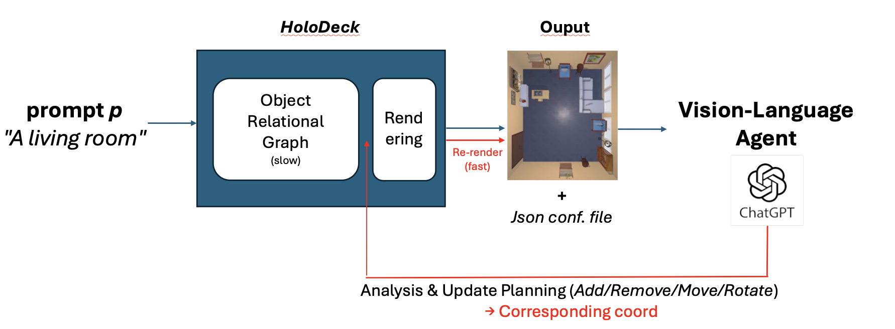

# Holodeck VLM Supervisor Agent

### Hacker: Donghwan Jang (djang12@illinois.edu)

This project extends the original Holodeck framework with a Vision-Language Model (VLM) supervisor agent for iterative scene refinement, along with additional utilities for scene modification, collision handling, and rendering.

## Setup

For detailed setup instructions, please refer to [README_holodeck.md](README_holodeck.md). The setup process includes:

1. **Environment Setup**: Creating a conda environment and installing dependencies
2. **Data Download**: Downloading Holodeck base data, assets, annotations, and features
3. **API Key Configuration**: Setting up OpenAI API key for scene generation

See `README_holodeck.md` for complete installation and setup instructions.

## Overview

This project extends the original Holodeck framework with additional utilities for scene modification, collision handling, rendering, and high-level layout revision. These tools enable iterative scene design and refinement workflows.

## Overall Pipeline

### Motivation: Addressing Limitations of the Original Pipeline

The original Holodeck pipeline relies on a single sequential planning process without refinement. This design has several limitations:

1. **Single Point of Failure**: Failure at any important planning stage can lead to drastic performance drop and unrealistic results
2. **"Brain-on-a-Stick" Problem**: The LLM acts as a "brain-on-a-stick," meaning it cannot access the actual execution results, which leads to mispredictions
3. **No Refinement Loop**: Once the scene is generated, there's no mechanism to iteratively improve it based on visual feedback

### VLM Supervisor Agent

To mitigate these limitations, we adopt a **Vision-Language Model (VLM) as a supervisor agent** that acts as a refinement tool. This approach:

- **Skips the slow object-retrieval stage**: Instead of regenerating objects, we directly update the overall scene with a single VLM inference
- **Provides visual feedback**: The VLM can analyze the actual rendered scene and identify issues
- **Enables iterative refinement**: The scene can be improved based on visual analysis

### Pipeline Workflow

The complete pipeline is illustrated below. The workflow consists of the following stages:



1. **Initial Scene Generation** (Holodeck):
   - Generate scene from natural language query using the original Holodeck pipeline
   - Output: Scene JSON and rendered top-down image

2. **VLM Analysis**:
   - The VLM analyzes the rendered scene image and scene JSON
   - Identifies issues such as:
     - Collisions or near-collisions between objects
     - Objects intersecting or unrealistically close to walls
     - Blocked paths or doorways
     - Functionally awkward placements
     - Redundant or visually cluttering objects

3. **Update Planning**:
   - The VLM categorizes operations into: **add**, **remove**, **move**, **rotate**
   - Maps those operations into corresponding coordinates
   - Outputs a **patch JSON** file

4. **Patch Application**:
   - The patch JSON is applied to the original scene JSON using `apply_json_patch.py`
   - Output: Updated scene JSON

5. **Re-rendering**:
   - The updated scene is re-rendered using `render_from_json.py`
   - Optional: Collision detection and fixing can be applied during rendering

6. **Iteration** (Optional):
   - The process can be repeated for further refinement

### VLM Prompt Modes

The VLM supervisor supports two modes, with corresponding prompts stored in the `prompt/` directory:

#### 1. Vision-Language Agent without Additional Human Guidance
**Prompt**: `prompt/vlm_supervisor`

- The VLM autonomously analyzes the scene and proposes improvements
- Input: Original scene JSON + rendered image
- Output: Patch JSON with suggested modifications
- Use case: Automatic scene refinement without human intervention

#### 2. Vision-Language Agent with Human Guidance
**Prompt**: `prompt/vlm_supervisor_w_guidance`

- The VLM receives additional guidance from the user:
  - **Text prompt**: Natural language instructions (e.g., "Move the sofa closer to the window")
  - **Edited image**: User manually edits the top-down image to indicate desired layout changes
- Input: Original scene JSON + rendered image + user text prompt + user-edited image
- Output: Patch JSON that incorporates user intent
- Use case: Interactive scene refinement with human feedback

**Key Features of the Guided Mode**:
- Collision avoidance is the highest priority (overrides user input except removals)
- Black regions in edited image indicate areas that should be empty (remove objects)
- Redrawn objects indicate movement/rotation
- Text prompt takes priority if it conflicts with the edited image
- Objects-on-top automatically follow parent furniture movements

### Patch JSON Format

The VLM outputs a **patch JSON** file (not a full scene JSON) that describes only the modifications:

```json
{
  "move": [
    {
      "object": "sofa-0",
      "position": {"x": 2.0, "y": 0.4, "z": 3.0},
      "rotation": {"y": 180}
    }
  ],
  "rotate": [
    {
      "object": "coffee_table-0",
      "rotation": {"y": 90}
    }
  ],
  "remove": [
    "lamp-0",
    "book-1"
  ]
}
```

This patch is then applied to the original scene JSON using `apply_json_patch.py`, which:
- Matches objects by name or ID
- Updates positions and rotations
- Removes specified objects
- Preserves all other scene elements

### Benefits of the VLM Supervisor Approach

1. **Efficiency**: Single VLM inference instead of full scene regeneration
2. **Visual Feedback**: Can analyze actual rendered results, not just JSON
3. **Iterative Refinement**: Enables multiple rounds of improvement
4. **Human-in-the-Loop**: Supports both autonomous and guided refinement
5. **Targeted Updates**: Only modifies problematic elements, preserving good parts of the scene

## New Utility Scripts

### 1. Scene Rendering from JSON (`render_from_json.py`)

**Purpose**: Render a top-down view image from a scene JSON file, with optional collision detection and fixing.

**Usage**:
```bash
python render_from_json.py --scene_json path/to/scene.json
```

**Key Features**:
- Loads scene JSON (supports compressed JSON format)
- Renders top-down view using AI2-THOR
- Automatically saves image next to JSON file (or custom path)
- **NEW**: Integrated collision detection and fixing before rendering
- Configurable image dimensions

**Options**:
- `--scene_json`: Path to scene JSON file (required)
- `--output_image`: Output image path (optional, defaults to same directory as input)
- `--width`: Image width in pixels (default: 1024)
- `--height`: Image height in pixels (default: 1024)
- `--fix_collisions`: Automatically fix collisions before rendering (default: False)
- `--overlap_threshold_ratio`: Ratio threshold for collision detection (default: 0.05)
- `--collision_strategy`: Strategy for fixing collisions: `remove_smaller` or `remove_all` (default: `remove_smaller`)

**Example**:
```bash
# Basic rendering
python render_from_json.py --scene_json scene.json

# Render with collision fixing
python render_from_json.py --scene_json scene.json --fix_collisions --overlap_threshold_ratio 0.1
```

---

### 2. Collision Detection and Resolution (`check_and_fix_collisions.py`)

**Purpose**: Detect and fix object collisions in scene JSON files.

**Usage**:
```bash
# Check for collisions only
python check_and_fix_collisions.py --scene_json scene.json --check_only

# Fix collisions and save
python check_and_fix_collisions.py --scene_json scene.json --output_json scene_fixed.json
```

**Key Features**:
- 3D bounding box collision detection
- Flexible collision threshold based on object volume ratio (not absolute values)
- Multiple resolution strategies (remove smaller object, remove all colliding objects)
- Preserves scene structure while fixing collisions

**Options**:
- `--scene_json`: Path to scene JSON file (required)
- `--check_only`: Only check for collisions, don't fix (default: False)
- `--output_json`: Path to save fixed scene (required if not `--check_only`)
- `--strategy`: Collision resolution strategy: `remove_smaller` or `remove_all` (default: `remove_smaller`)
- `--overlap_threshold_ratio`: Ratio threshold for collision detection (default: 0.05)

**Collision Detection Logic**:
- Uses 3D bounding box intersection
- Calculates overlap volume
- Compares against threshold: `overlap_volume < threshold_ratio * min(object1_volume, object2_volume)`
- Allows minor overlaps based on smaller object's volume

---

### 3. JSON Patching (`apply_json_patch.py`)

**Purpose**: Apply structured modifications (move, rotate, remove) to scene JSON files using a patch file.

**Usage**:
```bash
python apply_json_patch.py --scene_json scene.json --patch patch.json
```

If `patch.json` is in the same directory as the scene JSON, you can omit `--patch`:
```bash
python apply_json_patch.py --scene_json scene.json
```

**Patch File Format**:
```json
{
  "move": [
    {
      "object": "sofa-0",
      "position": {"x": 2.0, "y": 0.4, "z": 3.0},
      "rotation": {"y": 180}
    }
  ],
  "rotate": [
    {
      "object": "coffee_table-0",
      "rotation": {"y": 90}
    }
  ],
  "remove": [
    "lamp-0",
    "book-1"
  ]
}
```

**Key Features**:
- Structured modification format
- Supports moving, rotating, and removing objects
- Flexible object matching (by object_name or id)
- Default patch file location: `patch.json` in same directory as scene JSON

**Options**:
- `--scene_json`: Path to scene JSON file (required)
- `--patch`: Path to patch JSON file (default: `patch.json` in same directory as scene)
- `--output_json`: Path to save patched scene (default: adds `_patched` suffix)

---

### 4. High-Level Layout Revision (`revise_layout_high_level.py`)

**Purpose**: Modify scene layout at the design level (selected_objects) and regenerate the scene with constraints preserved, avoiding direct low-level JSON manipulation.

**Usage**:
```python
from revise_layout_high_level import revise_layout_and_regenerate

modifications = {
    "remove_objects": ["coffee_table-0", "lamp-1"],
    "add_objects": [
        {
            "room_type": "living room",
            "location": "floor",
            "object_name": "side_table-0",
            "description": "a small side table"
        }
    ],
    "modify_object_positions": {
        "sofa-0": {
            "position": {"x": 2.0, "y": 0.4, "z": 3.0},
            "rotation": {"y": 180}
        }
    }
}

revise_layout_and_regenerate(
    scene_json_path="scene.json",
    modifications=modifications,
    save_dir="./data/scenes",
    use_constraint=True
)
```

**Key Features**:
- High-level modifications to `selected_objects` instead of direct JSON editing
- Preserves constraint system during regeneration
- Description-based object retrieval for adding new objects
- Regenerates scene from `floor_objects` stage with constraints intact

**Modification Types**:
- `remove_objects`: List of object names/patterns to remove from selected_objects
- `add_objects`: List of objects to add (uses description-based retrieval similar to initial object selection)
- `modify_object_positions`: Dict mapping object names to new positions/rotations (directly modifies floor_objects)
- `modify_constraints`: Dict mapping room types to custom constraint plans (advanced, placeholder)

**Object Addition**:
- Uses `ObjathorRetriever` to find objects based on description
- Filters by room type and location (floor/wall)
- Similar to the original object selection logic

---

### 5. Scene JSON Simplification (`simplify_scene_json.py`)

**Purpose**: Remove non-rendering-essential fields from scene JSON to make it smaller and more readable to VLM agent.

**Usage**:
```bash
python simplify_scene_json.py --input_json scene.json
```

**Key Features**:
- Removes intermediate generation fields
- Keeps only rendering-essential data
- Default output: adds `_simple` suffix to input filename
- Optional: keep intermediate fields for debugging

**Fields Removed** (by default):
- `floor_objects`, `wall_objects`, `small_objects`, `ceiling_objects` (merged into `objects`)
- `selected_objects`: High-level object selection plan
- `object_selection_plan`: Detailed selection plan
- `raw_floor_plan`, `raw_doorway_plan`, `raw_window_plan`, `raw_ceiling_plan`: Raw LLM outputs
- `room_pairs`, `open_room_pairs`, `open_walls`: Intermediate room relationships
- `receptacle2small_objects`: Mapping of receptacles to small objects

**Fields Kept**:
- `objects`: Combined list of all objects
- `rooms`, `walls`, `doors`, `windows`: Structural elements
- `proceduralParameters`, `metadata`, `query`: Scene metadata

**Options**:
- `--input_json`: Path to input scene JSON (required)
- `--output_json`: Path to save simplified JSON (default: adds `_simple` suffix)
- `--keep_intermediate`: Keep intermediate fields like `floor_objects`, `wall_objects` (default: False)

---

## Enhanced Core Features

### 1. Simplified JSON Saving in `generate_scene`

**What Changed**: The `generate_scene` and `generate_scene_from_layout` methods now save simplified JSON by default.

**Usage**:
```python
# Saves simplified JSON by default
scene, save_dir = holodeck.generate_scene(
    scene=scene,
    query="a living room",
    save_dir="./data/scenes",
    save_simplified=True  # Default: True
)

# To save full verbose JSON
scene, save_dir = holodeck.generate_scene(
    scene=scene,
    query="a living room",
    save_dir="./data/scenes",
    save_simplified=False
)
```

**Benefits**:
- Smaller file sizes
- More readable JSON files
- Faster loading times
- Still contains all rendering-essential data

---

### 2. Scene Generation from Intermediate Stage (`generate_scene_from_layout`)

**Purpose**: Resume scene generation from an intermediate stage, allowing iterative refinement.

**Usage**:
```python
from ai2holodeck.generation.holodeck import Holodeck
import compress_json

holodeck = Holodeck(
    openai_api_key=os.environ.get("OPENAI_API_KEY"),
    objaverse_asset_dir=OBJATHOR_ASSETS_DIR
)

# Load partially generated scene
scene = compress_json.load("intermediate_scene.json")

# Continue from floor_objects stage
scene, save_dir = holodeck.generate_scene_from_layout(
    scene=scene,
    query="a living room",
    save_dir="./data/scenes",
    start_from="floor_objects",  # Options: "floor_objects", "wall_objects", "small_objects", "ceiling_objects"
    use_constraint=True,
    save_simplified=True
)
```

**Key Features**:
- Validates required components for the `start_from` stage
- Skips initial generation steps if already present in scene
- Preserves constraints and relationships
- Supports resuming from: `floor_objects`, `wall_objects`, `small_objects`, `ceiling_objects`

**Use Cases**:
- Modify `selected_objects` and regenerate from `floor_objects`
- Adjust room layout and regenerate from `wall_objects`
- Iterative refinement workflow

---

## How to Run

### Basic Scene Generation

Generate a scene from a natural language query:

```bash
python -m ai2holodeck.main --query "a living room" --openai_api_key <OPENAI_API_KEY>
```

This will generate a scene JSON file and save it to `./data/scenes/`.

### Scene Refinement Workflow

1. **Generate initial scene** (see above)
2. **Analyze and create patch**: Use a VLM (e.g., ChatGPT 5.1 or Gemini 2.0) to analyze the rendered scene and create a `patch.json` file
3. **Apply patch**: `python apply_json_patch.py --scene_json <scene.json>`
4. **Re-render**: `python render_from_json.py --scene_json <scene_patched.json> --fix_collisions`

See the **Workflow Examples** section below for detailed examples.

---

## Workflow Examples

### Example 1: Generate, Modify, and Re-render

```bash
# 1. Generate initial scene
python -m ai2holodeck.main --query "a living room"

# 2. Create patch file using (patch.json) (e.g., ChatGPT 5.1 or Gemini 2.0)
# {
#   "move": [{"object": "sofa-0", "position": {"x": 2.0, "y": 0.4, "z": 3.0}}],
#   "remove": ["lamp-0"]
# }

# 3. Apply patch
python apply_json_patch.py --scene_json data/scenes/a_living_room/a_living_room.json

# 4. Re-render with collision fixing
python render_from_json.py --scene_json data/scenes/a_living_room/a_living_room_patched.json --fix_collisions
```

### Example 2: High-Level Layout Revision

```python
from revise_layout_high_level import revise_layout_and_regenerate

# Remove objects and add new ones at design level
modifications = {
    "remove_objects": ["coffee_table-0"],
    "add_objects": [
        {
            "room_type": "living room",
            "location": "floor",
            "object_name": "side_table-0",
            "description": "a small side table next to sofa"
        }
    ]
}

revise_layout_and_regenerate(
    scene_json_path="data/scenes/a_living_room/a_living_room.json",
    modifications=modifications,
    save_dir="./data/scenes"
)
```

### Example 3: Check and Fix Collisions

```bash
# Check for collisions
python check_and_fix_collisions.py --scene_json scene.json --check_only

# Fix collisions with custom threshold
python check_and_fix_collisions.py \
    --scene_json scene.json \
    --output_json scene_fixed.json \
    --overlap_threshold_ratio 0.1 \
    --strategy remove_smaller
```

---

## Technical Details

### Collision Detection Algorithm

The collision detection uses 3D bounding box intersection:

1. Calculate bounding box for each object based on:
   - Object dimensions from asset database
   - Object position
   - Object rotation (affects x/z dimensions)

2. Check for 3D intersection between bounding boxes

3. Calculate overlap volume

4. Compare against threshold:
   ```
   overlap_volume < threshold_ratio * min(object1_volume, object2_volume)
   ```

5. This allows minor overlaps proportional to the smaller object's size

### Object Matching in Patches

The patch system supports flexible object matching:
- Exact match: `object_name` or `id`
- Prefix match: `id` starts with `object_name + " "` or `object_name + "|"`
- Examples:
  - `"sofa-0"` matches `{"object_name": "sofa-0"}` or `{"id": "sofa-0 (living room)"}`
  - `"book-3"` matches `{"id": "book-3|bookshelf-0 (living room)"}`

### Simplified JSON Structure

The simplified JSON contains only rendering-essential fields:
- All objects merged into single `objects` list
- Structural elements (rooms, walls, doors, windows)
- Metadata and query
- Removed: intermediate generation data, raw LLM outputs, selection plans

---

## Integration with Original Holodeck

All new utilities are designed to work seamlessly with the original Holodeck framework:

- **Compatible**: All utilities work with standard Holodeck scene JSON format
- **Non-invasive**: New features don't modify core Holodeck generation logic
- **Optional**: All utilities are standalone and can be used independently
- **Preserves Constraints**: High-level revision maintains constraint system

---

## File Structure

```
.
├── render_from_json.py              # Scene rendering utility
├── check_and_fix_collisions.py      # Collision detection and fixing
├── apply_json_patch.py              # JSON patching utility
├── revise_layout_high_level.py      # High-level layout revision
├── simplify_scene_json.py           # JSON simplification
├── generate_from_layout_example.py  # Example usage (optional)
└── ai2holodeck/
    └── generation/
        └── holodeck.py              # Enhanced with generate_scene_from_layout and simplified JSON saving
```

---

## Notes

- All utilities support both regular JSON and compressed JSON formats (via `compress_json`)
- Collision detection uses the same logic as the original Holodeck `SmallObjectGenerator`
- High-level revision requires OpenAI API key for object retrieval (same as main generation)
- Simplified JSON is backward compatible - can be loaded and rendered normally

